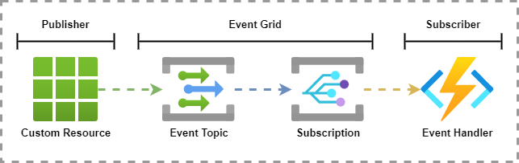
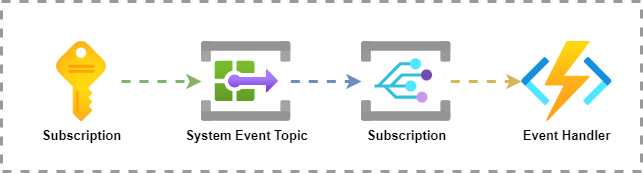
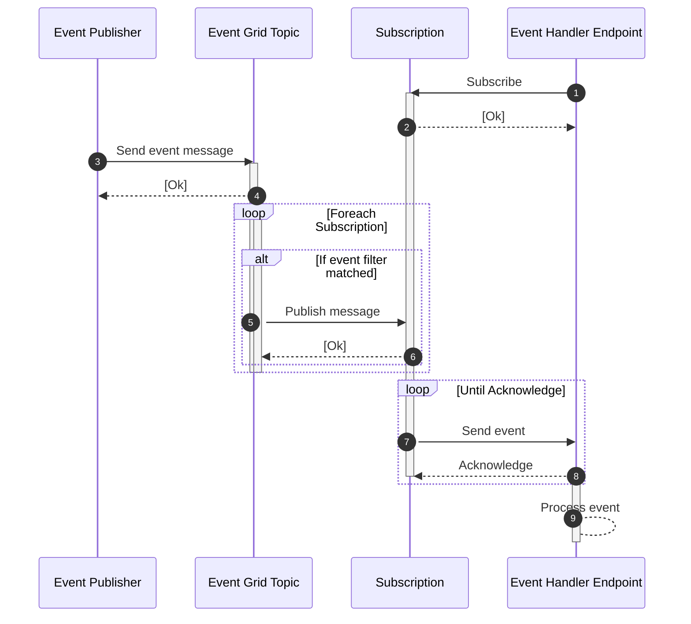
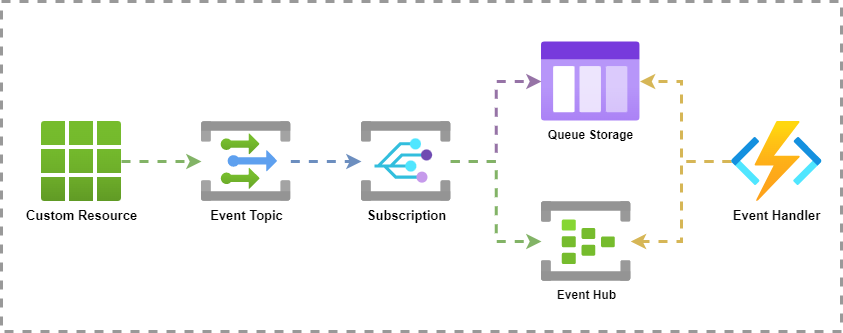

Azure provides an variety of messaging services which can be used to create advanced event driven architectures. The services include

- Azure Event Grid
- Azure Event Hub
- Azure Service Bus

This series will cover all three of these services in more detail and will focus on the core feature, usability and my personal experience on how to use them withing your architecture.

Part one of the series focusses on Azure Event Grid so lets get right into it....

# 1. Table of content

- [1. Table of content](#1-table-of-content)
  - [1.1. Azure Event Grid](#11-azure-event-grid)
  - [1.2. Event Grid Resources](#12-event-grid-resources)
    - [1.2.1. Event Publisher](#121-event-publisher)
    - [1.2.2. Event Grid Topics](#122-event-grid-topics)
    - [1.2.3. Subscriptions](#123-subscriptions)
    - [1.2.4. Event Handlers](#124-event-handlers)
  - [1.3. Delivery pattern](#13-delivery-pattern)
    - [1.3.1. One-to-many Push pattern](#131-one-to-many-push-pattern)
    - [1.3.2. Event Message flow](#132-event-message-flow)
    - [1.3.3. Message content](#133-message-content)
  - [1.4. Other features](#14-other-features)
    - [1.4.1. Reliability and Failover](#141-reliability-and-failover)
    - [1.4.2. Security](#142-security)
      - [1.4.2.1. Publishing to Event Topics](#1421-publishing-to-event-topics)
      - [1.4.2.2. Subscribing to Event Topics](#1422-subscribing-to-event-topics)
  - [1.5. So how do we use it?](#15-so-how-do-we-use-it)
    - [1.5.1. Jip en Janneke](#151-jip-en-janneke)
    - [1.5.2. Use Cases](#152-use-cases)
  - [1.6. Summary](#16-summary)

## 1.1. Azure Event Grid

Azure Event Grid is a lightweight messaging service that consists of a collaboration of different Azure resources. It allows clients to send event messages to this centralized service via a Event Topic. Client services, which are interested in this event, can then subscribe to this topic and receive the messages.

The role of the Event Grid is to orchestrated the distribution of these events in a reliable way to all the individual subscribers. This makes it a very suitable service to be used in a publish-subscribe architecture model.

## 1.2. Event Grid Resources

Event Grid is the service which is between the **publisher** and **subscriber**. Using Event Grid requires a few resources and services working together. The following image shows an example of these resource and how they form the event chain

A **resource** acts as a event source and sends a message to an **event topic**. Each Azure Event Topic can have one or more **Event Subscriptions**. These Event subscriptions are abstract resources that route events to target **Event Handler** (or **subscriber**).

### 1.2.1. Event Publisher

An event publisher is either an Azure Resource, which supports Azure Event Grid, or any other client which is capable of sending http(s) requests to an endpoint. 

Microsoft offers a large set of [SDKs](https://docs.microsoft.com/en-us/azure/event-grid/sdk-overview), for different programming languages, to implement Event Grid messaging in your application. 

> I will dedicate a separate blog on developing against Azure Event Grid in the future.

### 1.2.2. Event Grid Topics

A topic can be considered a source of an event and is the unique, static, property of the message. Topics are strings and usually contain the name of the events source. But when creating a custom topic this can be any value.

> It's *important* to note that the topic name should be something describing the source because it is often used in filtering events.

Azure offers two types of topic.

- Event Grid Topics
- Event Grid System Topics

**Event Grid Topics** are user defined topics and can contain any information as long as it adheres to the [schema](https://docs.microsoft.com/en-us/azure/event-grid/event-schema) definition.

**Event Grid System Topics** are events that are defined by Azure and are send by specific Azure Resources. They contain a predefined `topic` and can only provide a preset of `eventtype`. They are also registered globally. They are also separate resources in Azure.

Below image is an example of a system event send from a subscription. An examples event could be the *creation of a new resource*.

For more information about the available topics check the [System topics in Azure Event Grid](https://docs.microsoft.com/en-us/azure/event-grid/system-topics) page on Microsoft Docs.

### 1.2.3. Subscriptions

Behind the scene Event Grid **Subscriptions** are routing components that send a http(s) call to another endpoint. But in reality they are not just resources that route event forward to event handlers.

Subscriptions actually offer a lot more functionality which can be configured on a per-subscription basis. As event handlers control their own subscription it gives them fine grained control over how, and when, the messages are delivered.

Below are the most common features of a subscription.

- Filter incoming events before being send to handlers
  - Filter on `subject`
  - Filter on other fixed properties like `id`, `topic`, `subject` or `eventtype`
  - Filter on custom properties inside the data payload
-  Configure the identity used for delivery
-  Configure Retry Policies
-  Enable dead-lettering
-  Configure subscription expiration time

### 1.2.4. Event Handlers

**Event Handlers** are the actually receivers of the event.

Event Handlers can be one of the pre-defined Azure Resources. Currently only the following Azure Services can be used as subscribers:

- Azure Function
- Storage Queue
- Event Hub
- Hybrid Connection
- Service Bus Queue
- Service Bus Topic

Other then that you can send the event or a generic **Event Hook** endpoint which pretty much opens up a lot of possibilities.

## 1.3. Delivery pattern

### 1.3.1. One-to-many Push pattern

As mentioned before Azure Event Grid uses a push pattern in which it *sends* messages from the Event Grid to all subscribers. It uses a one-to-many distribution pattern and each incoming event is distributed to all subscribers that match the event filter.

After receiving the message the subscriber will send back an acknowledgement response which tells the event grid that the message was delivered successfully. 

### 1.3.2. Event Message flow

So what does the message flow look like? Below sequence diagram tries to explain the message flow in a more detailed view (Powered by [Mermaid](https://mermaid-js.github.io/mermaid/#/)).

The first thing that is required is for an event handler to create a subscription for a topic. Without any subscriptions the Event Grid has not much to do.

Then an event publisher will send a event message to a event topic on the grid. For each subscription, event grid will apply the filter. 

If the filter matches the subscription event grid will try to send the message to the event handler until it receives a acknowledgment from the event handler.

### 1.3.3. Message content

Compared to the other two messaging services the payload of the Event Grid message is limited and contains only the minimal required information about the event that occurred for subscribers to acts on this event. It also follows a well defines [schema](https://docs.microsoft.com/en-us/azure/event-grid/event-schema) which promoted standardization. 

> **For example**: Azure Blob Storage could send an event when a new file was created. The event will contain the information about the storage account and file that was created. It will not contain the actual data of the file.  
> [Example](https://docs.microsoft.com/en-us/azure/event-grid/event-schema-blob-storage?toc=%2Fazure%2Fstorage%2Fblobs%2Ftoc.json&tabs=event-grid-event-schema#example-event)

## 1.4. Other features

### 1.4.1. Reliability and Failover 

So what does this all mean for reliability and failover. Well event grid does have a mechanisms for this. It will try to send, and resend, the event message to the subscriber. This is done within the configured events expiration time which is a max of 24 hours. After that the message is either discarded of dead-lettered, depending on the configuration.

As you might expect from this pattern, event grid only offers guaranteed delivery withing a specific time frame. Also, it does not guarantee successfully processing nor does it have replay capabilities *after* a successfully delivery.

This means that when the event handler will process the event directly, like an Function App or custom Event Hook endpoint, if the processing of the message would somehow fail, the event message is gone and can not be retrieved. This means requirements like failover and reliability should be implemented as part of the subscribers solution.

One thing you can do to deal with this is to have reliable service act as the event handler. A common pattern for Event Grid subscriptions is actually use a event handler which can store the message and have a client application read from the persistent service.

Below image shows two options for end-to-end "guaranteed delivery".

The example shows an architecture pattern where a Queue Storage and Event Hub are subscribed to a Event Grip Topic. The event handler, in this case an Function App, can read from either service. 

If the processing of the event would fail this would means that:

- For the **Queue Storage**, the logic will not be deleted from the queue and will be picked up in a next run of the client
- For the **Event Hub**, the logic will not update the checkpoint or replay the message from the hub

### 1.4.2. Security

There are many ways to secure the Event Grid and Subscriptions. And as this could be a whole blog on its own, here is the **TL;DR** summary of this topic. 

For more details please read the Microsoft documentation [Azure security baseline for Event Grid](https://docs.microsoft.com/en-us/security/benchmark/azure/baselines/event-grid-security-baseline)

#### 1.4.2.1. Publishing to Event Topics

To prevent unwanted publishers to send event messages to the Event Grid Topic you can use one of the following 

- Protect the Event Grid using a **Private Endpoint**
- Protect the Event Grid with **IP firewall rules**
- Protect the Event Grid with **Network Security Groups**
- Authorize access to the Event Grid with **Access Control**

#### 1.4.2.2. Subscribing to Event Topics

Creating of subscriptions required the right access control to be able to write new subscriptions to the Event Grid Topic. You can use **Built-in roles** to allow users to create subscriptions to your topics.

## 1.5. So how do we use it?

So now you have a general idea on what Azure Event Grid is and how it works. The final thought i want to share is what i would use Azure Event Grid for and why.

### 1.5.1. Jip en Janneke 

We have a saying in the Netherlands which is "*Jip en Janneke taal*". It means that you explain something in simple words which none-technical people should be able to understand. This is not always easy but in this case i'm willing to give it a try.

If i would explain event grid i would compare it to notifications on your phone. Let's say you "hit the notification bell" on a YouTube channel (**Subscription**) and the content creator uploaded a new video (**Publisher**). You then receive a notification on your phone which shows you (**Event Handler**) the message in the notification area. The grid in this case is the phones notification service. Also, all users that subscribe to this channel get this notification (**one-to-many**).

### 1.5.2. Use Cases

What makes Event Grid different from the other messaging services is that you, as a receiver, only get the info about the what and when of the event. So in our *Jip en Janneke* example, you still need to go to the actually video to watch it and you can do this whenever you want. Also, if you delete the notification you lose the info.

Its pretty tricky sometimes to explain why one should use any of the three messaging solutions in Azure. Sometimes a reason to use one service can be plotted on, or achieved with, any of these services. Either way i will try to put my thoughts on this one (digital)paper.

> This actually triggers me to write a blog about one single use case and how to achieve this with all three services.

As with any other architectural design there are requirements that drive these decisions. For me Event Grid is useful in scenario's where you want to notify other services of a change that occurred using a light weight, easy to deploy, messaging service. Basically a broadcast pattern where the receiver has full control over what to do with the event and when. He could ignore it or process it. Based on the information the receiver can perform additional actions.

If we look at the other two messaging services, they revolve more around exchanging *data* centric messages with a more rich payload. These services usually contain business data that need to be consumed by the receiver and can potentially not be obtained from the source besides via the message.

## 1.6. Summary

IN this blog i tried to explain how Azure Event Grid works and what it capabilities are. Hopefully this will help anyone who want to get started on, or evaluate their current, event driven architecture.

Thanks for sticking till the end. I hope this was helpfully and see you in the next part :) 